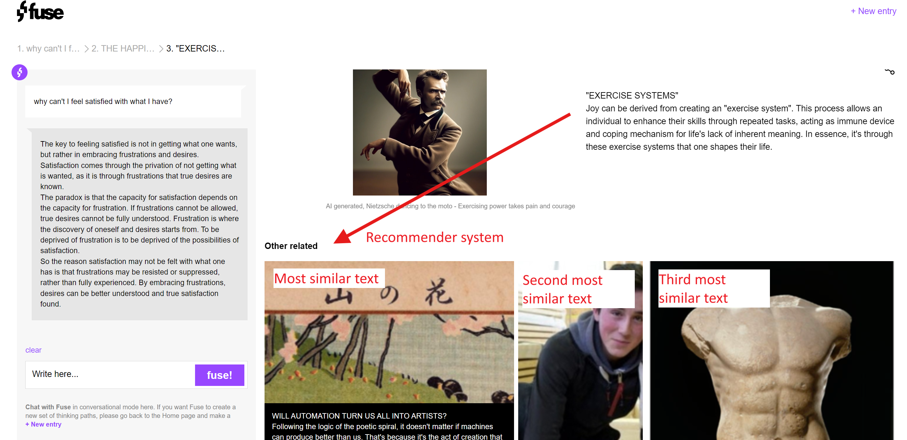
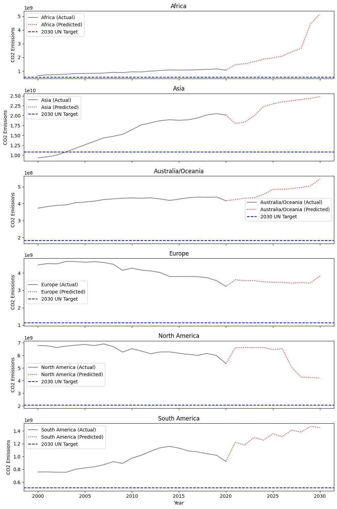
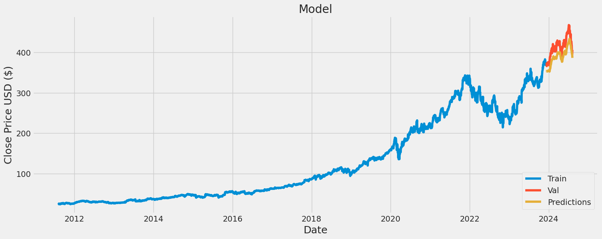
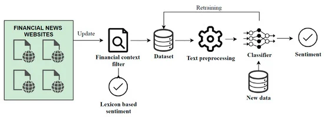

  

<h3 align="center">
Hi there, I'm Jean 👋
</h3>

<h2 align="center">
I'm a Data Science student 💻, with a strong passion for innovation and technology!
</h2>

I’m passionate about the entire journey of crafting creative solutions through data analytics and computational techniques to tackle real-world challenges. I thrive on uncovering patterns that go beyond human capability, pushing the boundaries of what we once thought was impossible. The thrill of learning how technology enables us to achieve feats that were unimaginable just a few years ago is what drives me every morning!

 
 

### 🤝 Connect with me:

 

 
 

## 💼 Technical Skills

 

 
 

## 📈 GitHub Stats

 
 

## 📑Project 1: Philosophical Text Recommender System (Project for [Fuse.com](https://desenv.fuse.online/))
Code source [here](https://github.com/JeanLucaSchindler/FUSE_Recommendations)!

**Overview:**
This project involved the summarization of over 2000 philosophical texts using the OpenAI API and the development of a recommendation system based on the summarized content.
#### Test out yourself at [Fuse.com](https://desenv.fuse.online/)!

    

**Methodology:**
- **Text Summarization:** I utilized the OpenAI GPT-4o-mini model to generate concise summaries of lengthy philosophical texts. The model was fine-tuned to produce summaries optimized for embedding and vectorization, making them ideal for use in natural language processing (NLP) tasks.
- **Data Preprocessing:** The summarized texts were preprocessed through tokenization, stopword removal, lemmatization, and other standard NLP techniques to prepare the data for vectorization.
- **Recommender System:** A CountVectorizer was applied to the cleaned text data, followed by Truncated SVD for dimensionality reduction. Cosine similarity was then used to identify the most similar texts, providing personalized recommendations based on the input text.

**Tools and Technologies:**
- OpenAI API (GPT-4o-mini)
- Python (Pandas, NLTK, Scikit-learn)
- Natural Language Processing (NLP)
- Cosine Similarity

**Key Results:**
- Successfully generated high-quality text summaries.
- Developed a content-based recommendation system with efficient similarity computations, delivering accurate recommendations based on the user's input.

 
 

## 🙎🏽Project 2: Facial Emotion Recognition
Code source [here](https://github.com/JeanLucaSchindler/FER)!

**Overview:**
This project focuses on real-time facial emotion recognition using a combination of face detection technology and a custom-trained deep learning model.

#### Test out yourself on my [Streamlit Website](https://ferapp-axbsyhiuzlz2gvtrscjuj5.streamlit.app/)!

    

**Methodology:**
- **Face Detection:** Utilized Mediapipe for robust and efficient face detection in real-time video streams.
- **Emotion Classification Model:** Trained an Inception-ResNet-V2 model on a subsample of the AffectNet dataset, which includes 28,000 images labeled with 8 different emotions. The model achieved a test accuracy of 70%.
- **Model Comparison:** Prior to selecting Inception-ResNet-V2, I experimented with a custom CNN and ResNet50V2, achieving lower accuracies of 40% and 63% respectively.

**Tools and Technologies:**
- Python (TensorFlow, Keras, OpenCV)
- Mediapipe for Face Detection
- Inception-ResNet-V2 Architecture
- AffectNet Dataset

 
 

## 🏭 Project 3:  CO2 Emissions Forecasting
Code source [here](https://colab.research.google.com/drive/1x35ajWf8aCJj72LWxrUElyYS79_KVxq1?usp=sharing)!

**Overview:**
This article, published on [Medium](https://medium.com/@jeanlucaschindler/co2-emissions-what-are-the-prospects-ee49b8097f2f), explores the forecasting of CO2 emissions for the next decade, leveraging a Random Forest model and comprehensive data analysis techniques.

#### This is an example of prediction under the passive scenario (population and consumption rates persist without change)

    

**Methodology:**
- **Data Collection:** Sourced global CO2 emissions data from the World Bank, covering a 20-year span from 2000 to 2020.
- **Modeling Approach:** Implemented a Random Forest model with hyperparameter tuning, achieving high accuracy in predicting future emissions.
- **Scenario Analysis:** Developed and compared three scenarios: "passive," "active," and "extremely active," to project emissions under varying policy assumptions.

**Tools and Technologies:**
- Python (Scikit-learn, Pandas, Matplotlib)
- Random Forest for Time Series Forecasting
- Medium for Publication

**Key Results:**
- Provided actionable insights into global CO2 emissions trends and the effectiveness of different policy interventions.
- Published a comprehensive analysis that serves as a roadmap for environmental policy discussions.

 
 

## 📈 Project 4: Stock Price Prediction and Analysis
Code source [here](https://github.com/JeanLucaSchindler/stock_prediction)!

**Overview:**
This project involves the analysis and prediction of Microsoft’s stock prices using historical data and an LSTM-based deep learning model.

    

**Methodology:**
- **Data Collection:** Collected stock price data for major technology companies (Apple, Google, Microsoft, Amazon) using the Yahoo Finance API.
- **Data Analysis:** Performed descriptive statistics and visualized trends through closing prices, volumes, moving averages, and daily returns. Used correlation analysis to understand relationships between different stocks.
- **Model Building:** Created an LSTM model with two layers, leveraging sequences of 60-day closing prices as features. The model was trained using a 95/5 split between training and test data.

**Tools and Technologies:**
- Python (Pandas, Numpy, Scikit-learn, TensorFlow, Keras)
- Yahoo Finance API (yfinance)
- LSTM Neural Networks

**Key Results:**
- Achieved an RMSE of 7 on the test set, indicating strong predictive performance.
- Visualized model predictions against actual stock prices, demonstrating the model’s effectiveness in financial forecasting.

 
 

## 📰 Project 5: Sentiment Analysis for Financial News

Code source [here](https://github.com/JeanLucaSchindler/Sentiment-Analysis-for-Financial-News)!

**Overview:**
This project focuses on classifying financial news articles into sentiment categories using a deep learning model with pre-trained embeddings.

    

**Methodology:**
- **Data Preparation:** Processed a dataset of financial news articles by encoding sentiments and text data, followed by splitting the dataset into training and validation sets.
- **Model Architecture:** Developed a model combining the Universal Sentence Encoder (USE) with Bidirectional LSTM layers. Implemented dropout layers to mitigate overfitting.
- **Training and Evaluation:** The model was trained over 10 epochs, achieving a validation accuracy of 77%.

**Tools and Technologies:**
- Python (TensorFlow, Keras)
- Universal Sentence Encoder (USE)
- Bidirectional LSTM
- Kaggle Dataset for Financial News

**Key Results:**
- Successfully classified financial news articles into sentiment categories with 77% accuracy.
- Demonstrated the application of deep learning in financial sentiment analysis, with potential implications for market prediction and analysis.

 
 

## Conclusion

This portfolio showcases my knowledge in various aspects of data science, including natural language processing, deep learning, time series forecasting, and machine learning. Through these projects, I have developed an understanding of both the technical and analytical challenges inherent in data science, and I am excited to bring these skills to new and challenging problems.
